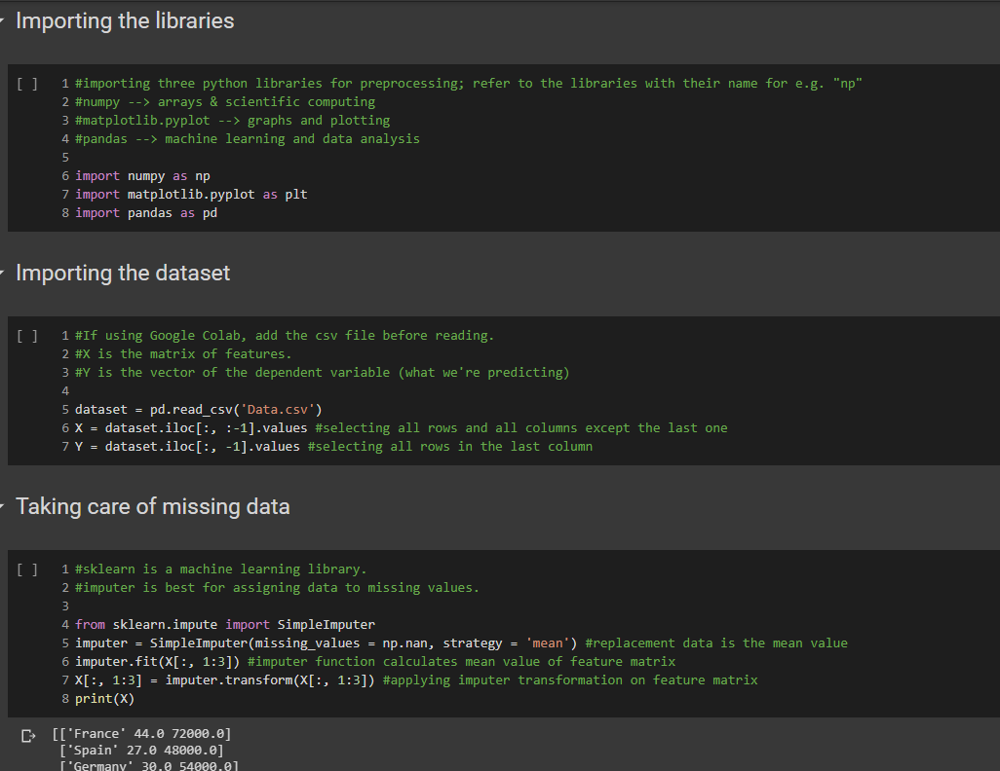

# Notes Upon The Udemy Machine Learning A-Z Course Python Notebooks

#### **What You Will Find:**

 This repository contains clear explanations and annotations of all of the python notebooks taught in the Machine Learning A-Z Course offered by Udemy. They are the perfect source for someone looking to refresh their ML basics and for beginners to who are experiencing the fun of Machine Learning for the very first time.

_All of the annotations are my own work and were made to help programmers (including myself) better understand the course tutorials._ 

#### **List of notebooks:**

1. Data Preprocessing Tools
2. Simple Linear Regression

#### **Sample of annotations in Data Preprocessing Tools Notebook:**

